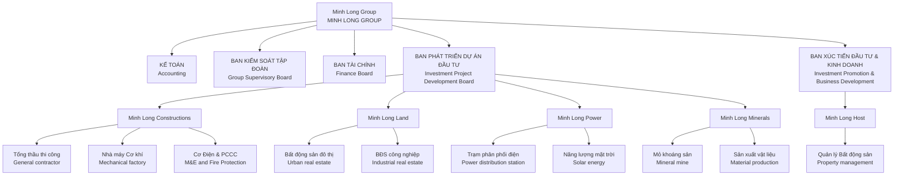

# Website Doanh Nghiệp — Requirements Document

Đây là tài liệu yêu cầu từng bước cho sản phẩm **Website Doanh Nghiệp**. Tài liệu dùng ngôn ngữ đơn giản để bất kỳ ai cũng hiểu ứng dụng cần làm gì và nên xây dựng theo thứ tự nào.

Mục đích của tài liệu:
1. Dễ hiểu cho người code.
2. Dùng ngôn ngữ rõ ràng, tránh thuật ngữ kỹ thuật thừa.
3. Đánh số từng mục để dễ tham chiếu khi yêu cầu triển khai trong Cursor.
4. **Mục 12** gom **user story, chức năng backend CMS, build step, vị trí ảnh cấu hình** để chuẩn bị làm admin/backend (đa ngôn ngữ, Spatie, shadcn editor, thư viện file, liên hệ).

---

## 1. Tổng Quan Sản Phẩm

**Website Doanh Nghiệp** là website giới thiệu công ty, dịch vụ/sản phẩm, tin tức/blog, và kênh liên hệ. Hệ thống có **khu vực quản trị (admin)** để quản lý nội dung và cấu hình website.

- **Chủ thể website / Brand owner:** **MinhLong Group** (thống nhất dùng tên này trong nội dung giao diện và tài liệu).

Các ý chính:
- Website có **trang giới thiệu**, **trang dịch vụ/sản phẩm**, **trang blog/tin tức**, **trang liên hệ**, và các trang tĩnh khác (ví dụ: Tuyển dụng, Chính sách… nếu cần).
- Admin có thể **đăng nhập**, **quản lý bài viết blog**, **quản lý khách hàng gửi liên hệ**, **cấu hình settings website** như logo, thông tin liên hệ, SEO cơ bản.
- Hệ thống có **dashboard** để xem số lượt truy cập, số liên hệ mới, số bài viết, và một số log hành động quan trọng (đăng bài, chỉnh sửa settings…).

### 1.1 Đối tượng sử dụng

- **Admin (doanh nghiệp)**:
  - Đăng nhập vào trang quản trị.
  - Quản lý **danh mục bài viết** và **danh mục dự án**; bài viết/blog **đa ngôn ngữ** với cơ chế **liên kết bản dịch** cùng chủ đề.
  - Quản lý **dự án** (gán danh mục theo lĩnh vực), **upload ảnh** (Spatie Media Library), soạn thảo nội dung bằng **editor shadcn** (rich text).
  - Quản lý **thư viện tài liệu** (CSV, Excel, Word, PDF) phục vụ mục **Hồ sơ / Báo cáo** — người dùng frontend có thể tải xuống.
  - Quản lý **form liên hệ** từ frontend (danh sách, trạng thái, chi tiết).
  - Quản lý trang nội dung chính (giới thiệu, dịch vụ chính…) khi đã nối CMS.
  - Cấu hình **settings website**: tiêu đề site, **thông tin liên hệ**, và **thay thế hình ảnh** tại các **vị trí quan trọng** trên giao diện (xem mục 12.4).
  - Xem thống kê tổng quan trong dashboard.
- **Khách truy cập (visitor)**:
  - Xem thông tin công ty, dịch vụ/sản phẩm, tin tức.
  - Gửi form liên hệ (tên, email, điện thoại, nội dung).

### 1.2 Luồng chính

1. Admin đăng nhập vào trang quản trị.
2. Admin cấu hình các **settings website** ban đầu: logo, tên website, tiêu đề/mô tả SEO, thông tin liên hệ.
3. Admin tạo các **bài viết blog** (danh mục, bài viết) và nội dung các trang chính (giới thiệu, dịch vụ…).
4. Khách truy cập vào website, xem nội dung, đọc blog.
5. Khách gửi form liên hệ → hệ thống lưu thông tin vào bảng khách hàng/liên hệ, đồng thời có thể gửi email thông báo cho admin (optional).
6. Admin vào dashboard xem số liệu: lượt truy cập (pageview), số liên hệ mới, số bài viết, log hành động gần đây.

---

## 2. Mục Tiêu Chính

1. Có **trang quản trị với chức năng đăng nhập bảo mật** cho admin.
2. Admin có thể **quản lý bài viết blog/tin tức**: danh mục, bài viết, trạng thái hiển thị.
3. Admin có thể **quản lý settings website**:
   - Logo, favicon.
   - Tên website, tiêu đề & mô tả SEO mặc định.
   - Thông tin liên hệ: số điện thoại, email, địa chỉ, link bản đồ (optional).
   - Social links: Facebook, YouTube, Zalo, v.v. (optional).
4. Hệ thống **lưu lại thông tin khách hàng** khi gửi form liên hệ (tên, email, điện thoại, nội dung, thời gian).
5. Có **dashboard** hiển thị thống kê cơ bản: số lượt truy cập (có thể đơn giản là tổng view), số liên hệ mới, số bài viết, số trang, và log hành động chính (tạo bài viết, chỉnh sửa settings…).
6. Website frontend hiển thị đẹp, responsive, phù hợp cho 1 trang web doanh nghiệp cơ bản.
7. **Backend CMS**: quản trị danh mục (bài viết + dự án), nội dung đa ngôn ngữ, thư viện file, cấu hình media toàn site, và xử lý liên hệ — theo user story & build step mục 3, 4, 7, **12**.
8. Có thể mở rộng thêm các module: FAQ, newsletter… nhưng không bắt buộc giai đoạn đầu.

---

## 3. User Stories

| ID   | Story |
|------|--------|
| **US-001** | Là admin, tôi muốn đăng nhập bằng email/mật khẩu để truy cập trang quản trị. |
| **US-002** | Là admin, tôi muốn đổi mật khẩu của mình để tăng bảo mật. |
| **US-003** | Là admin, tôi muốn cấu hình logo, favicon, tên website, tiêu đề và mô tả SEO mặc định cho toàn site. |
| **US-004** | Là admin, tôi muốn cấu hình thông tin liên hệ (số điện thoại, email, địa chỉ) để hiển thị trên header/footer và trang liên hệ. |
| **US-005** | Là admin, tôi muốn tạo, chỉnh sửa, xóa bài viết blog và gán chúng vào danh mục để quản lý tin tức. |
| **US-006** | Là admin, tôi muốn bật/tắt trạng thái hiển thị của bài viết (draft/published) để chuẩn bị nội dung trước khi public. |
| **US-007** | Là admin, tôi muốn xem danh sách khách hàng đã gửi form liên hệ kèm thông tin chi tiết (tên, email, SĐT, nội dung, thời gian). |
| **US-008** | Là admin, tôi muốn lọc, tìm kiếm danh sách liên hệ theo thời gian hoặc từ khóa để dễ xử lý. |
| **US-009** | Là admin, tôi muốn xem dashboard tổng quan gồm số lượt truy cập, số liên hệ mới, số bài viết, và log hành động gần đây. |
| **US-010** | Là khách truy cập, tôi muốn xem thông tin giới thiệu công ty, dịch vụ/sản phẩm, tin tức, và có form liên hệ rõ ràng. |
| **US-011** | Là khách truy cập, tôi muốn gửi form liên hệ đơn giản (tên, email, SĐT, nội dung) và nhận thông báo gửi thành công. |
| **US-012** | (Đề xuất) Là admin, tôi muốn export danh sách liên hệ ra file Excel để lưu trữ hoặc xử lý offline. |
| **US-013** | (Đề xuất) Là admin, tôi muốn cấu hình SEO riêng cho từng bài viết (meta title, meta description, slug). |
| **US-014** | Là admin, tôi muốn **quản lý danh mục bài viết** (CRUD, slug, thứ tự, trạng thái) để phân loại tin tức theo nhu cầu. |
| **US-015** | Là admin, tôi muốn **quản lý danh mục dự án** (CRUD) để gom nhóm dự án theo lĩnh vực (Constructor, Land, Host, Power, Minerals, tin tức chung…). |
| **US-016** | Là admin, tôi muốn khi cài đặt môi trường mới có **sẵn danh mục** (seed) khớp các lĩnh vực: **Constructor**, **Land**, **Host**, **Power**, **Minerals**, và **Tin tức chung** — cho cả danh mục bài viết và danh mục dự án (nếu áp dụng tương ứng). |
| **US-017** | Là admin, tôi muốn **tạo bài viết theo từng ngôn ngữ** (locale), mỗi locale có tiêu đề, slug, mô tả, nội dung riêng. |
| **US-018** | Là admin, tôi muốn **liên kết một cách thông minh** các bài cùng một chủ đề nhưng khác ngôn ngữ (ví dụ: EN ↔ VI ↔ ZH) để frontend hiển thị chuyển ngôn ngữ đúng bài và SEO có `hreflang` / `alternate`. |
| **US-019** | Là admin, tôi muốn soạn **nội dung bài viết** bằng **editor shadcn** (rich text, thân thiện, hỗ trợ heading, list, link, embed cơ bản). |
| **US-020** | Là admin, tôi muốn **upload ảnh** cho bài viết và media (đại diện, gallery) dùng **Spatie Laravel Media Library** (collection, disk, resize optional). |
| **US-021** | Là admin, tôi muốn **cấu hình hình ảnh** tại các **vị trí cố định** trên website (hero, logo, favicon, khối dịch vụ, banner lĩnh vực…) thay cho file tĩnh trong `public/`. |
| **US-022** | Là admin, tôi muốn chỉnh **tiêu đề website**, **meta mặc định**, và **thông tin liên hệ** (phone, email, địa chỉ, map, social) từ một màn hình cài đặt. |
| **US-023** | Là admin, tôi muốn quản lý **thư viện tài liệu**: upload file **CSV, Excel (.xlsx), Word (.doc/.docx), PDF**; gán loại **Profile** hoặc **Báo cáo**; cho phép **public download** trên frontend. |
| **US-024** | Là admin, tôi muốn xem **danh sách liên hệ** do khách gửi từ form frontend, lọc theo thời gian/trạng thái, xem chi tiết và đánh dấu đã xử lý. |
| **US-025** | Là khách, tôi muốn đến trang **Hồ sơ / Báo cáo** (hoặc tương đương) và **tải xuống** các tài liệu do admin đăng (đúng định dạng). |

---

## 4. Features

| ID   | Feature | Mô tả ngắn | Khi nào xuất hiện | Khi lỗi |
|------|---------|------------|--------------------|---------|
| **F-001** | Đăng nhập admin | Form email/mật khẩu; validate cơ bản; lưu session; middleware bảo vệ trang admin. | Trang `/admin/login`. | Hiển thị thông báo lỗi rõ ràng nếu sai thông tin; không tiết lộ quá chi tiết. |
| **F-002** | Quản lý tài khoản admin | Admin có thể đổi mật khẩu, cập nhật tên hiển thị. | Trang "Tài khoản của tôi" trong admin. | Giữ dữ liệu form, thông báo lỗi cụ thể. |
| **F-003** | Cấu hình website (General Settings) | Form nhập: tên website, slogan (optional), logo upload, favicon upload, meta title/description mặc định. | Menu "Cài đặt" → "Chung". | Nếu upload file lỗi hoặc định dạng không hợp lệ, thông báo rõ ràng. |
| **F-004** | Cấu hình thông tin liên hệ | Form nhập: phone, email, address, link bản đồ (Google Maps embed link), social links (Facebook, YouTube, Zalo…). | Menu "Cài đặt" → "Liên hệ". | Validate dữ liệu (email hợp lệ, URL hợp lệ); báo lỗi nếu không lưu được. |
| **F-005** | Danh mục blog | CRUD danh mục bài viết (tên, slug, mô tả ngắn, trạng thái). | Menu "Blog" → "Danh mục". | Nếu xóa danh mục đang có bài viết, cần cảnh báo hoặc không cho xóa. |
| **F-006** | Quản lý bài viết blog | CRUD bài viết: tiêu đề, slug, danh mục, nội dung (editor), ảnh đại diện, trạng thái (draft/published), ngày hiển thị, meta title/description. | Menu "Blog" → "Bài viết". | Validate bắt buộc tiêu đề, slug duy nhất; báo lỗi nếu trùng slug. |
| **F-007** | Hiển thị blog ở frontend | Danh sách bài viết, chi tiết bài viết, phân trang, sidebar bài viết mới nhất (optional). | Trang `/blog` và trang chi tiết `/blog/{slug}`. | Nếu bài viết không tồn tại hoặc đã tắt hiển thị, trả về 404. |
| **F-008** | Trang liên hệ & form liên hệ | Form nhập: tên, email, SĐT, nội dung; captcha đơn giản (optional); sau khi submit hiển thị thông báo gửi thành công. | Trang `/lien-he` hoặc `/contact`. | Hiển thị lỗi validate trên form; không reload trắng dữ liệu nếu có lỗi. |
| **F-009** | Lưu thông tin liên hệ | Mỗi lần gửi form, hệ thống lưu vào bảng liên hệ: tên, email, SĐT, nội dung, IP, user-agent, thời gian; trạng thái (mới/xử lý). | Sau khi submit form liên hệ. | Nếu lưu thất bại, hiển thị thông báo "Có lỗi xảy ra, vui lòng thử lại sau". |
| **F-010** | Quản lý liên hệ trong admin | Danh sách liên hệ với bộ lọc theo trạng thái/thời gian; xem chi tiết; đổi trạng thái (ví dụ: đã liên hệ lại). | Menu "Khách hàng" hoặc "Liên hệ". | Nếu load thất bại, cho phép bấm "Tải lại". |
| **F-011** | Dashboard thống kê | Hiển thị: tổng lượt truy cập (đơn giản), số liên hệ mới (theo ngày/tuần/tháng), số bài viết, log hành động gần đây (tạo/sửa/xóa bài, đổi settings…). | Trang đầu tiên sau khi đăng nhập admin. | Nếu một phần thống kê lỗi, không làm sập toàn bộ dashboard; hiển thị thông báo nhẹ ở khu vực đó. |
| **F-012** | Ghi log truy cập | Lưu truy cập đơn giản: đường dẫn, IP, user-agent, thời gian; có thể gộp để đếm pageview. | Tự động ở frontend (middleware). | Có thể bỏ qua lỗi ghi log để không ảnh hưởng người dùng. |
| **F-013** | Export liên hệ ra Excel (đề xuất) | Nút "Xuất Excel" trên màn danh sách liên hệ: xuất file Excel chứa các cột cơ bản. | Trong admin → "Khách hàng/Liên hệ". | Nếu xuất lỗi, hiển thị thông báo và không download file rỗng. |
| **F-014** | Danh mục bài viết | CRUD: tên, slug, mô tả, sort order, `is_active`; không xóa cứng nếu còn bài (hoặc reassign). | Admin → Blog → Danh mục. | Validate slug unique; cảnh báo khi xóa có dữ liệu con. |
| **F-015** | Danh mục dự án | CRUD tương tự danh mục bài viết; dùng để lọc/nhóm dự án theo lĩnh vực. | Admin → Dự án → Danh mục. | Giống F-014. |
| **F-016** | Seeder danh mục theo lĩnh vực | Migration + seeder tạo sẵn danh mục: **Constructor**, **Land**, **Host**, **Power**, **Minerals**, **Tin tức chung** (key/slug cố định để code tham chiếu). | `php artisan migrate --seed`. | Idempotent seed (updateOrCreate) để chạy lại an toàn. |
| **F-017** | Bài viết đa ngôn ngữ | Model `Post` + `PostTranslation` (hoặc `posts` + locale columns) hoặc bảng `post_translations`: mỗi bản ghi theo `locale` có title, slug, excerpt, body HTML, SEO meta. | Admin → Blog → Bài viết. | Slug unique theo **(locale, slug)**; không trùng logic với bài khác. |
| **F-018** | Nhóm bản dịch (translation set) | Một **translation_group_id** (UUID) hoặc bảng `post_translation_links` gắn các bản `Post`/`PostTranslation` cùng chủ đề; admin chọn “bài tương ứng” khi tạo/sửa. | Form bài viết. | Không cho loop; một bài chỉ thuộc một nhóm. |
| **F-019** | Editor nội dung (shadcn) | Giao diện admin (React/Inertia hoặc SPA) dùng **shadcn/ui** + editor TipTap (hoặc tương đương trong hệ sinh thái shadcn) lưu HTML sanitize; upload ảnh trong bài qua API Spatie. | Màn tạo/sửa bài. | XSS: sanitize HTML; giới hạn kích thước file upload. |
| **F-020** | Media ảnh (Spatie) | Đăng ký `HasMedia` cho Post, Project, Document; collections: `featured`, `content`, `gallery`; disk `public` hoặc S3. | Trong form bài viết/dự án. | MIME whitelist; lỗi upload thông báo rõ. |
| **F-021** | Cài đặt hình ảnh theo vị trí | Key-value hoặc bảng `media_settings` (position_key → media_id / path); map sang frontend (xem **12.4**). | Admin → Cài đặt → Hình ảnh / Media. | Fallback ảnh mặc định trong theme nếu chưa cấu hình. |
| **F-022** | Cài đặt chung & liên hệ | Tiêu đề site, meta default, logo, favicon, phone, email, địa chỉ, map embed, social (mở rộng F-003/F-004). | Cài đặt. | Validate JSON/URL cho map. |
| **F-023** | Thư viện tài liệu | Model `Document` hoặc `LibraryFile`: title, loại (profile \| report), file qua Spatie, `mime`, `disk`, `is_public`, `sort_order`; route download signed hoặc public nếu policy cho phép. | Admin → Thư viện. | Chỉ cho phép MIME: pdf, csv, xlsx/xls, doc/docx; virus scan (optional sau). |
| **F-024** | Frontend Profile & Báo cáo | Trang list + nút tải file; chỉ hiển thị file `is_public`. | `/profile` / `/reports` hoặc route tương đương. | 404 nếu file ẩn; log download (optional). |

---

## 5. Màn Hình / Trang

| ID   | Màn hình | Nội dung | Điều hướng |
|------|----------|----------|------------|
| **S-001** | Đăng nhập admin | Form email, mật khẩu; link "Quên mật khẩu" (optional). | Khi vào `/admin` mà chưa đăng nhập sẽ redirect về `/admin/login`. |
| **S-002** | Dashboard admin | Thống kê cơ bản (F-011), danh sách log hành động gần đây. | Sau khi đăng nhập thành công. |
| **S-003** | Danh sách bài viết | Bảng: tiêu đề, danh mục, trạng thái, ngày tạo, thao tác edit/delete; có tìm kiếm theo tiêu đề. | Menu "Blog" → "Bài viết". |
| **S-004** | Form tạo/sửa bài viết | Form: tiêu đề, slug, chọn danh mục, nội dung (editor), upload ảnh, meta title/description, trạng thái. | Từ S-003 bấm "Thêm mới" hoặc "Chỉnh sửa". |
| **S-005** | Danh sách danh mục blog | Bảng: tên, slug, số bài viết, trạng thái, thao tác. | Menu "Blog" → "Danh mục". |
| **S-006** | Cài đặt chung | Form settings chung: tên website, slogan, logo, favicon, meta title/description mặc định. | Menu "Cài đặt" → "Chung". |
| **S-007** | Cài đặt liên hệ | Form: phone, email, address, map link, social links. | Menu "Cài đặt" → "Liên hệ". |
| **S-008** | Danh sách liên hệ | Bảng: tên, email, SĐT, trạng thái, thời gian gửi; filter theo trạng thái/thời gian; nút export Excel (nếu làm). | Menu "Khách hàng" hoặc "Liên hệ". |
| **S-009** | Chi tiết liên hệ | Thông tin đầy đủ của 1 liên hệ + chú thích nội bộ (optional). | Click 1 dòng từ S-008. |
| **S-010** | Trang chủ (frontend) | Banner, giới thiệu ngắn, các dịch vụ chính, một số bài blog mới, block thông tin liên hệ. | `/`. |
| **S-011** | Trang giới thiệu | Nội dung giới thiệu chi tiết công ty (có thể quản lý bằng page builder đơn giản hoặc static). | `/gioi-thieu`. |
| **S-012** | Trang blog | Danh sách bài blog với phân trang. | `/blog`. |
| **S-013** | Trang chi tiết blog | Nội dung bài viết, bài liên quan. | `/blog/{slug}`. |
| **S-014** | Trang liên hệ | Thông tin liên hệ + form liên hệ (F-008). | `/lien-he`. |
| **S-015** | Danh mục dự án (admin) | Bảng danh mục dự án; thao tác CRUD. | Admin → Dự án → Danh mục. |
| **S-016** | Danh sách / form dự án | Tiêu đề đa ngôn ngữ, danh mục, ảnh, mô tả, slug; liên kết bản dịch (optional). | Admin → Dự án. |
| **S-017** | Cài đặt hình ảnh theo vị trí | Form chọn/upload ảnh cho từng `position_key` (hero, services…). | Admin → Cài đặt → Media / Hình ảnh. |
| **S-018** | Thư viện tài liệu | Danh sách file Profile/Báo cáo; upload; bật/tắt public download. | Admin → Thư viện. |
| **S-019** | Trang tải tài liệu (frontend) | Danh sách file được phép tải (Profile / Báo cáo). | Route public tùy cấu trúc URL. |

---

## 6. Dữ Liệu (Data)

| ID   | Data | Mô tả |
|------|------|--------|
| **D-001** | User (admin) | Email, tên, mật khẩu (hash), vai trò (admin), last_login_at. |
| **D-002** | Settings chung | key, value, group (ví dụ: `site_name`, `site_logo`, `default_meta_title`, `contact_phone`, `contact_email`, `contact_address`…), kiểu dữ liệu (string/text/json). |
| **D-003** | Danh mục blog | id, name, slug, description, status, created_at, updated_at. |
| **D-004** | Bài viết blog | id, category_id, title, slug, excerpt, content, thumbnail_path, status (draft/published), published_at, meta_title, meta_description, created_at, updated_at, created_by. |
| **D-005** | Liên hệ khách hàng | id, name, email, phone, message, status (new/processing/done), ip, user_agent, created_at, updated_at. |
| **D-006** | Log truy cập | id, path, ip, user_agent, referrer (optional), created_at. |
| **D-007** | Log hành động admin | id, user_id, action (ví dụ: `create_post`, `update_settings`), payload (json), created_at. |
| **D-008** | Danh mục dự án | id, name, slug, description, sort_order, is_active, type hoặc `sector` enum (constructor, land, host, power, minerals, general_news) — tùy thiết kế; created_at, updated_at. |
| **D-009** | Dự án (Project) | id, category_id (FK), translation_group_id (nullable, UUID) — nếu tách bảng translation tương tự Post; hoặc bảng `project_translations`; status; published_at; created_by. |
| **D-010** | Nhóm bản dịch nội dung | `translation_group_id` (UUID) dùng chung cho Post/Project: mọi bản theo locale cùng group = cùng chủ đề; hoặc bảng pivot `content_translation_groups`. |
| **D-011** | Bài viết đa ngôn ngữ | Cấu trúc gợi ý: `posts` (id, category_id, status, translation_group_id, author_id, published_at) + `post_translations` (post_id hoặc post_id per locale: id, locale, title, slug, excerpt, body, meta_title, meta_description); **hoặc** một bảng `posts` với `locale` + `master_id` trỏ bản gốc — cần chọn một pattern và nhất quán. |
| **D-012** | Media (Spatie) | Bảng `media` của package; polymorphic `model_type`, `model_id`; collection names; order. |
| **D-013** | Cài đặt vị trí ảnh | `site_media_positions` hoặc key trong settings: `position_key` (string), `media_id` FK hoặc path; updated_at. |
| **D-014** | Thư viện file (Profile/Báo cáo) | id, title, category (`profile` \| `report`), is_public, sort_order, polymorphic media_id hoặc disk path; created_at. |

---

## 7. Build Steps (Gợi Ý Thứ Tự)

| ID   | Bước | Nội dung |
|------|------|----------|
| **B-001** | Auth admin | Tạo model User (admin), seed 1 admin mặc định; tạo routes và view cho đăng nhập, middleware `auth:admin` cho khu vực `/admin`. |
| **B-002** | Settings cơ bản | Tạo bảng settings (D-002), màn hình S-006 và S-007; load settings ra frontend (header/footer). |
| **B-003** | Blog backend | Tạo bảng danh mục (D-003) và bài viết (D-004); màn hình S-003, S-004, S-005; routes và controller cho CRUD. |
| **B-004** | Blog frontend | Hiển thị trang blog (S-012, S-013) với phân trang; hiển thị 3–5 bài mới nhất ở trang chủ. |
| **B-005** | Trang tĩnh & layout | Xây dựng layout frontend chung (header, footer, breadcrumb, responsive); tạo trang chủ (S-010), giới thiệu (S-011), liên hệ (S-014). |
| **B-006** | Form liên hệ & lưu liên hệ | Tạo form liên hệ (F-008), validate, lưu D-005 (F-009), trang admin S-008, S-009. |
| **B-007** | Dashboard & logs | Tạo bảng log truy cập (D-006) và log hành động admin (D-007); middleware ghi log truy cập; màn hình S-002. |
| **B-008** | Export Excel (nếu làm) | Thêm chức năng export danh sách liên hệ ra Excel (F-013). |
| **B-009** | Chuyển HTML sang Frontend | Có sẵn thư mục HTML (template/mockup); cần chuyển thành giao diện frontend của website, tích hợp HTML và đường dẫn resource hợp lý, tách layout/header/footer; phần nội dung đã có backend thì lấy dữ liệu thật (kèm seeder); phần chưa có backend giữ nội dung demo. Xem **Rule: Chuyển thư mục HTML sang Frontend** (mục 9). |
| **B-010** | Chuẩn bị package & quy ước | Cài **spatie/laravel-medialibrary**; cấu hình disk, collections; quy ước đặt tên collection (`featured`, `content`, `documents`). Chuẩn bị stack admin cho **shadcn + editor** (ví dụ Inertia + React + TipTap) nếu tách khỏi Blade thuần. |
| **B-011** | Danh mục & seed lĩnh vực | Migration `post_categories`, `project_categories` (hoặc gộp nếu dùng enum + một bảng); **CategorySeeder** tạo sẵn: Constructor, Land, Host, Power, Minerals, Tin tức chung — slug/key cố định (`constructor`, `land`, `host`, `power`, `minerals`, `general`). |
| **B-012** | Mô hình đa ngôn ngữ cho Post | Triển khai D-011; policy slug unique theo locale; accessor URL frontend `/blog/{locale}/{slug}` hoặc prefix locale (thống nhất với middleware `SetLocale`). |
| **B-013** | Liên kết bản dịch | Thêm `translation_group_id` (UUID) sinh khi tạo “chủ đề” mới; UI admin chọn bài/dự án cùng nhóm khi thêm ngôn ngữ; API `hreflang` và link chuyển ngôn trên trang chi tiết. |
| **B-014** | Admin: CRUD Post + Editor | Form create/edit **full width** (layout rộng, nhóm trường hợp lý: nội dung chính / sidebar xuất bản & SEO). **TipTap** (toolbar shadcn/ui) cho body HTML; nút chèn ảnh mở **thư viện ảnh** (dialog: lưới ảnh đã upload + upload mới). Backend: model `EditorMediaItem` + **Spatie** collection `image`, conversion `thumb` (khi server có **GD hoặc Imagick**); API `GET/POST /admin/editor-media` (JSON, auth). Tests Feature cho route editor-media và policy. |
| **B-015** | Projects backend | CRUD dự án + đa ngôn ngữ + media; frontend trang listing/filter theo danh mục. |
| **B-016** | Settings mở rộng | Bảng/key cho **vị trí ảnh** (12.4); helper `site_media('hero.home.main')` hoặc tương đương; cache config. |
| **B-017** | Thư viện tài liệu | Model + upload validation MIME; route download; trang frontend Profile/Báo cáo. |
| **B-018** | Liên hệ | Đảm bảo `Contact`/`Lead` lưu đủ field; admin index + filter; rate limit + honeypot (optional). |
| **B-019** | QA & i18n | Test đa ngôn ngữ, seed demo mỗi locale; kiểm tra alternate links và 404 slug. |

---

## 8. Chi Tiết Bổ Sung

- **Công nghệ gợi ý**: Laravel cho backend, Blade/Livewire cho admin, frontend có thể dùng Blade + Tailwind/Bootstrap tùy ý.
- **Bảo mật**: Hash mật khẩu (bcrypt), CSRF token cho form, rate limit form liên hệ (đề xuất), phân quyền rõ ràng cho admin.
- **Hiệu năng**: Cache settings, cache danh mục/bài viết phổ biến nếu traffic cao (có thể làm sau).
- **SEO & UX**: URL thân thiện (slug), thẻ meta cơ bản, Open Graph cho bài viết, sitemap (optional).
- **Đa ngôn ngữ**: Website hỗ trợ đa ngôn ngữ (i18n); **ngôn ngữ mặc định là tiếng Anh (English)**. Khi triển khai mới hoặc chỉnh sửa giao diện/nội dung, ưu tiên nội dung và nhãn mặc định bằng tiếng Anh; chuẩn bị cấu trúc (locale, file dịch, URL) để mở rộng thêm ngôn ngữ sau. Xem **Rule: Đa ngôn ngữ** (mục 10). Nội dung **bài viết/dự án** đa ngôn ngữ và **nhóm bản dịch** — xem **mục 12**.
- **Backend CMS (dự kiến)**: Admin dùng **Spatie Media Library** cho ảnh/tài liệu; editor bài viết dùng **shadcn** (React) nếu admin xây bằng Inertia — xem **mục 12** và **F-014–F-024**.

---

## 9. Rule: Chuyển thư mục HTML sang Frontend

Khi thực hiện **B-009** (hoặc khi có yêu cầu chuyển một folder HTML thành giao diện frontend), tuân thủ các bước sau:

1. **Tích hợp HTML và đường dẫn resource**
   - Đảm bảo tích hợp được toàn bộ file HTML vào cấu trúc frontend (Vite/Blade/Inertia tùy dự án).
   - Chỉnh lại đường dẫn CSS, JS, hình ảnh, font… cho đúng với cấu trúc public/build (ví dụ: `asset()`, `Vite::`, hoặc import trong bundle) để không bị lỗi 404.
   - **KHÔNG** dùng `file_get_contents()` + `str_replace()` trong Blade để render HTML mỗi request; thay vào đó, copy HTML cần dùng vào Blade và chỉnh sửa trực tiếp trong view (hoặc tách thành partials).

2. **Bóc tách và chia layout**
   - Tự bóc tách HTML thành các phần dùng chung:
     - **Layout** chính (wrapper, grid, container chung).
     - **Header** (logo, menu, hotline…).
     - **Footer** (thông tin liên hệ, link, copyright…).
   - Các trang con dùng chung layout/header/footer, chỉ thay đổi phần nội dung (content) giữa header và footer.

3. **Nội dung đã có chức năng backend**
   - Kiểm tra từng khối nội dung: nếu đã có API/model/trang quản trị tương ứng (blog, liên hệ, settings, dịch vụ…) thì:
     - Đưa dữ liệu thật ra frontend (qua controller, props, hoặc API).
     - Viết **seeder** cho backend để có dữ liệu mẫu đủ dùng ngoài frontend (bài viết, danh mục, settings, v.v.).
   - Đảm bảo frontend hiển thị đúng dữ liệu từ backend, không hard-code nội dung thật trong HTML.

4. **Nội dung chưa có backend**
   - Khối nào chưa có model/API/trang quản trị thì **giữ nguyên nội dung demo** (placeholder) trong HTML/frontend.
   - Có thể đánh dấu (comment hoặc TODO) để sau này thay bằng dữ liệu thật khi backend đã có.

5. **Thứ tự ưu tiên**
   - Có thể thực hiện B-009 sau khi đã có layout và một số backend cơ bản (B-001, B-002, B-005…) để dễ map dữ liệu; hoặc làm B-009 trước rồi từ từ nối backend vào từng khối.

---
## 9.1 Rule: Khi tôi yêu cầu sửa nội dung thì chỉ sửa Blade

Khi tôi yêu cầu bạn **sửa nội dung** (đổi text/heading/section layout, cập nhật link hiển thị, chỉnh cấu trúc phần hiển thị trên website), bạn **chỉ cần sửa các file `.blade.php`** tương ứng.

Các file `.html` trong `public/frontend` chỉ để lưu nội dung tham chiếu để bạn lấy ra khi chuyển đổi (template/mockup), vì vậy **không cần sửa `.html`** trong các yêu cầu “sửa nội dung” của tôi.

*(Ngoại lệ: chỉ sửa `.html` nếu tôi nói rõ ràng yêu cầu chỉnh sửa trực tiếp file HTML.)*

---

## 10. Rule: Đa ngôn ngữ (i18n)

Website sử dụng **đa ngôn ngữ**. Khi triển khai hoặc chỉnh sửa, tuân thủ:

1. **Ngôn ngữ mặc định**
   - **Tiếng Anh (English)** là ngôn ngữ mặc định của website.
   - Nội dung tĩnh (label, placeholder, thông báo), nội dung mẫu/seed, và giao diện mặc định nên dùng tiếng Anh.

2. **Khi viết code / giao diện**
   - Ưu tiên chuỗi hiển thị mặc định bằng tiếng Anh (ví dụ: "Contact Us", "Read More", "Send Message").
   - Chuẩn bị sẵn cấu trúc hỗ trợ đa ngôn ngữ: dùng key dịch (lang file, `__()`, `@lang`) thay vì hard-code chuỗi khi có thể; hoặc ghi chú TODO i18n cho các chuỗi sẽ dịch sau.

3. **Khi mở rộng thêm ngôn ngữ**
   - Xác định danh sách locale (ví dụ: `en`, `vi`); lưu preference ngôn ngữ (session, cookie, hoặc URL prefix).
   - Nội dung từ backend (bài viết, danh mục, settings) có thể có bản dịch theo locale (bảng/field riêng hoặc file dịch tương ứng).

4. **Tham chiếu**
   - Có thể nói "làm theo Rule đa ngôn ngữ mục 10" hoặc "ngôn ngữ mặc định tiếng Anh" khi yêu cầu Cursor triển khai tính năng hoặc sửa giao diện.

---

## 11. Tài liệu nội dung — Hero & Brand (Minh Long Group)

Tài liệu tham chiếu để tạo/cập nhật nội dung hero và thương hiệu. Website mặc định dùng **bản tiếng Anh** (xem mục 10).

### 11.1 Branding

- **Tên thương hiệu:** Minh Long Group  
- **Logo:** "Group" (chữ script, màu đen) + "MINH LONG" (chữ in hoa, sans-serif, màu nâu đỏ).  
- **Phong cách:** Thanh lịch, chuyên nghiệp; đường kẻ ngang tách header và nội dung.

### 11.2 Hero section — Nội dung gốc (Tiếng Việt)

- **Tiêu đề chính:** Định hình khối lớn  
- **Tiêu đề phụ:** HÀNH TRÌNH KIM TỰ THÁP  
- **Đoạn mô tả:**  
  Năm 2026, Minh Long Group bước vào giai đoạn phát triển mới với chủ đề "Định hình khối lớn" trong "Hành trình Kim tự tháp". Điều này đánh dấu quá trình hoàn thiện của một tập đoàn đa lĩnh vực vận hành trên nền tảng hệ thống đồng bộ và tầm nhìn dài hạn. Minh Long Group hướng tới sự phát triển theo cấu trúc thống nhất, nâng cao năng lực quản trị, mở rộng quy mô hoạt động và gia tăng giá trị hợp tác đối tác trong và ngoài nước. "Định hình khối lớn" thể hiện cam kết xây dựng nền tảng bền vững, sẵn sàng cho các bước tiến lớn về quy mô, chất lượng và vị thế trên thị trường trong giai đoạn tiếp theo.

### 11.3 Hero section — Content for website (English, default)

- **Hero tagline / eyebrow (small):** THE PYRAMID JOURNEY  
- **Hero title (main):** Shaping a Great Mass  
- **Hero description:**  
  In 2026, Minh Long Group enters a new phase of development under the theme "Shaping a Great Mass" as part of the "Pyramid Journey." This marks the maturation of a multi-sector corporation operating on a synchronized system with a long-term vision. Minh Long Group aims for development under a unified structure, enhancing management capacity, expanding operational scale, and increasing the value of domestic and international partnerships. "Shaping a Great Mass" represents a commitment to building a sustainable foundation, ready for significant leaps in scale, quality, and market position in the upcoming period.

### 11.4 Gợi ý giao diện hero

- **Bố trí:** Tagline (nhỏ, trên) → Title (lớn, nổi bật) → Description (đoạn văn). Có thể thêm nút CTA (e.g. Contact Us / Get in touch) và/hoặc video.  
- **Màu:** Nâu đỏ (accent/logo), đen (chữ chính); nền off-white/beige nhạt.  
- **Font:** Script hoặc serif cho title; sans-serif cho tagline và body.

### 11.5 Company introduction content (About Us source)

- **Section title:** XAY DUNG MINH LONG  
- **Sub-title:** MINH LONG CONSTRUCTION / 明龙建设 或 明龙建筑

- **Vietnamese source text:**  
  Cong ty Co phan Xay dung va Cong nghiep Minh Long la tong thau EPC hang dau chuyen thi cong tron goi cong trinh cong nghiep. Voi doi ngu chuyen gia, quy trinh quan tri tien tien va cam ket tien do - chat luong - an toan, Minh Long mang den giai phap thi cong toi uu, tiet kiem chi phi va gia tri ben vung cho chu dau tu.

- **English website version (default):**  
  Minh Long Construction and Industry Joint Stock Company is a leading EPC general contractor specializing in turnkey industrial projects. With a team of experts, advanced management processes, and strong commitments to schedule, quality, and safety, Minh Long delivers optimized construction solutions that reduce costs and create sustainable value for investors.

- **Chinese reference text (optional for later i18n):**  
  明龙建设与工业股份公司是领先的EPC总承包商，专注于工业工程的交钥匙施工。凭借专家团队、先进的管理流程以及对进度、品质与安全的承诺，明龙为业主提供优化的施工解决方案，降低成本并创造可持续价值。

- **Content intent for About Us on homepage:**  
  Nhan manh vai tro tong thau EPC, nang luc quan tri, cam ket tien do/quality/safety, va gia tri ben vung cho doi tac - nha dau tu.

### 11.6 Services content source (Homepage services section)

- **Service 01 (VI):** TU VAN THIET KE  
  Minh Long Constructions cung cap dich vu tu van va thiet ke cho cac cong trinh dan dung, cong nghiep va ha tang, voi giai phap toi uu ve cong nang, tham my, chi phi va tinh ben vung.

- **Service 01 (EN - website default):** Design Consulting  
  Minh Long Constructions provides consulting and design services for civil, industrial, and infrastructure projects, delivering optimal solutions in functionality, aesthetics, cost efficiency, and sustainability.

- **Service 02 (VI):** NHA THAU THI CONG  
  Minh Long Constructions thi cong cac cong trinh xay dung tren pham vi ca nuoc, cam ket chat luong, tien do va an toan lao dong.

- **Service 02 (EN - website default):** Construction Contractor  
  Minh Long Constructions executes construction projects nationwide with strong commitments to quality, schedule, and safety.

- **Service 03 (VI):** NHA MAY SAN XUAT THEP  
  San xuat va cung cap thep xay dung, thep ket cau dap ung cac tieu chuan ky thuat cua cong trinh.

- **Service 03 (EN - website default):** Steel Manufacturing Plant  
  Manufacturing and supplying construction and structural steel products that meet technical standards.

- **Service 04 (VI):** TONG THAU CO DIEN & PCCC  
  Cung cap dich vu tong thau co dien va phong chay chua chay, tu thiet ke den thi cong.

- **Service 04 (EN - website default):** MEP & Fire Protection General Contractor  
  Providing general contracting services for MEP and fire protection systems, from design to installation.

- **Content intent for Services on homepage:**  
  Truyen tai ro 4 nhom nang luc cot loi cua MinhLong Group: tu van thiet ke, thi cong, san xuat thep, va tong thau co dien - PCCC.

### 11.7 What We Do content source (Homepage what-we-do section)

- **Section title (VI):** TONG THAU THI CONG XAY DUNG  
- **Section description (VI):**  
  XAY DUNG MINH LONG se la to chuc mang toi cac trai nghiem dich vu "Tu van thiet ke, thi cong xay dung, hoan thien cong trinh" tuyet voi nhat o cac du an Dan dung & Cong nghiep.

- **Section title (EN - website default):** Main Contractor for Construction  
- **Section description (EN - website default):**  
  Hai Phong Electromechanical Company, a member of Minh Long Group, specializes in electrical infrastructure and M&E systems for industrial and civil projects. With skilled engineers, strict construction processes, and commitments to schedule, quality, and safety, the company delivers integrated, cost-optimized solutions for investors.

- **Chinese reference (optional for i18n):**  
  建築總承包商  
  海防机电公司，明龙集团成员，专注于工业与民用工程的电力基础设施及机电（M&E）系统施工。凭借高技能工程师、严格的施工流程以及对进度、质量与安全的承诺，公司为业主提供集成化、成本优化的解决方案。

- **Content intent for What We Do on homepage:**  
  Nhan manh vai tro tong thau thi cong, nang luc M&E, va cam ket thi cong: dung tien do - dung chat luong - dung an toan.

### 11.8 Minh Long Land — Services & projects

#### 11.8.1 Minh Long Land introduction

- **Section title:** MINH LONG LAND  
- **Vietnamese paragraph:**  
  *Minh Long Land là bộ phận phát triển bất động sản của Minh Long Group, chuyên đầu tư và triển khai các dự án đô thị, bất động sản công nghiệp và nhà ở xã hội. Với tầm nhìn bền vững, đội ngũ chuyên môn và quy trình quản trị chuyên nghiệp, Minh Long Land tạo ra các khu đô thị hiện đại, khu công nghiệp hiệu quả và giải pháp nhà ở an toàn, giá cả hợp lý cho cộng đồng.*  
- **English paragraph (default for website):**  
  *Minh Long Land is the real estate development arm of Minh Long Group, specializing in investment and delivery of urban projects, industrial real estate, and social housing. With a sustainable vision, professional expertise, and robust governance processes, Minh Long Land creates modern townships, efficient industrial clusters, and affordable, safe housing solutions for communities.*  
- **Chinese paragraph (reference):**  
  明龙置地是明龙集团的地产开发部门，专注于投资与实施城镇项目、工业地产和保障性住房。凭借可持续的发展愿景、专业团队和完善的治理流程，明龙置地打造现代化城镇、高效的工业园区以及安全、价格合理的住房解决方案。  
- **Tagline (VI):** "Nền tảng cho phát triển bền vững"  
- **Tagline (EN):** "Foundation for sustainable development"

#### 11.8.2 Minh Long Land – Real estate segments

**Segment 1 — Bất động sản đô thị / Urban real estate / 城市房地產**

- Khu đô thị, khu dân cư  
  - Residential community / 城市新區  
- Chung cư thương mại  
  - Commercial apartment / 商業公寓  
- Khách sạn, nhà thương mại  
  - Hotel, commercial building / 商業大樓  

**Segment 2 — Bất động sản công nghiệp / Industrial real estate / 工業房地產**

- Khu công nghiệp  
  - Industrial park / 工業園區  
- Cụm công nghiệp  
  - Industrial cluster / 工業集群  
- Kho bãi, nhà xưởng cho thuê  
  - Warehouses and factory / 倉儲與租賃型製造廠房  

**Segment 3 — Nhà ở xã hội / Social housing / 社會住宅**

- Nhà ở xã hội thấp tầng  
  - Low-rise social housing / 低層社會住宅  
- Nhà ở xã hội cao tầng  
  - High-rise social housing / 高層社會住宅  

#### 11.8.3 Minh Long Land – Key projects

- **Dự án nhà ở xã hội LHP – Hải Phòng**  
  - LHP Social Housing Project – Hai Phong / LHP 保障性住房項目 – 海防  
- **Cụm công nghiệp Bần Thiện**  
  - Ban Thien Industrial Cluster / 板善工業集群  
- **Tổ hợp nhà xưởng cho thuê – KCN Nam Cầu Kiền, Hải Phòng**  
  - Factory Complex for Lease – Nam Cau Kien Industrial Zone, Hai Phong / 租賃型廠房綜合體 – 南Cầu Kiền工業區, 海防  

#### 11.8.4 Minh Long Land – Industrial focus message

- **Vietnamese:**  
  *Tập trung đầu tư mạnh vào khu công nghiệp và thúc đẩy phát triển dự án công nghiệp quy mô, tối ưu hạ tầng để thu hút nhà đầu tư chiến lược.*  
- **English (default):**  
  *Focus on heavy investment in industrial parks and robust development of industrial projects, optimizing infrastructure to attract strategic investors.*  
- **Chinese (reference):**  
  重点投资工业园区，致力推动工业项目发展，优化基础设施以吸引战略投资者。  

#### 11.9 Minh Long Group — Organization Structure (Sơ đồ tổ chức)

Tham chiếu nội dung từ sơ đồ tổ chức Minh Long Group (có song ngữ).

Các đầu mối/đơn vị chính:

- **KẾ TOÁN / Accounting**
- **BAN KIỂM SOÁT TẬP ĐOÀN / Group Supervisory Board**
- **BAN TÀI CHÍNH / Finance Board**
- **BAN PHÁT TRIỂN DỰ ÁN ĐẦU TƯ / Investment Project Development Board**
- **Minh Long Constructions**
  - Tổng thầu thi công / General contractor
  - Nhà máy Cơ khí / Mechanical factory
  - Cơ Điện & PCCC / M&E and Fire Protection
- **Minh Long Land**
  - Bất động sản đô thị / Urban real estate
  - BĐS công nghiệp / Industrial real estate
- **Minh Long Power**
  - Trạm phân phối điện / Power distribution station
  - Năng lượng mặt trời / Solar energy
- **Minh Long Minerals**
  - Mỏ khoáng sản / Mineral mine
  - Sản xuất vật liệu / Material production
- **BAN XÚC TIẾN ĐẦU TƯ & KINH DOANH / Investment Promotion & Business Development**
- **Minh Long Host**
  - Quản lý Bất động sản / Property management

Mermaid sơ đồ tổ chức (để dùng trực tiếp trong Markdown):

---

#### 11.10 Minh Long Construction — Human Resources (Nguồn nhân lực)

- **Nguồn ảnh:** `@public/frontend/images/hr/minh-long-construction-hr.png`
- **Mục đích dùng nội dung:** tham chiếu cho section/khối nội dung liên quan đến **nguồn nhân lực, năng lực đội ngũ, và hoạt động tuyển dụng/nhân sự** của **Minh Long Construction**.

#### 11.11 Minh Long Minerals — Mining & Processing (Khai thác & chế biến)

- **Nguồn ảnh:** `@public/frontend/images/minerals/minh-long-minerals.png`

Các mảng năng lực (từ nội dung trên ảnh):

- **KHAI THÁC & CHẾ BIẾN** / **MINING & PROCESSING**
- **SẢN XUẤT VẬT LIỆU XÂY DỰNG** / **PRODUCTION OF CONSTRUCTION MATERIALS**
- **SAN LẤP MẶT BẰNG** / **LAND RECLAMATION**
- **BUÔN BÁN VẬT LIỆU HẠ TẦNG** / **TRADING OF INFRASTRUCTURE MATERIALS**

Tên nhãn tiếng Trung (tham chiếu từ ảnh):

- 开采勘加工 / 生产建筑材料 / 土地平整回填 / 基建材料买卖

Gợi ý copy cho website (tiếng Anh mặc định):

- **Section heading:** Minh Long Minerals
- **Short description (EN):**
  Minh Long Minerals supports industrial land and construction execution through mining & processing, production of building materials, land reclamation, and trading of infrastructure materials.

#### 11.12 Minh Long Host — Core Principles & Implementation Model (Nguyên lý & mô hình triển khai)

- **Nguồn ảnh:** `@public/frontend/images/host/minh-long-host.png`

Gợi ý nội dung (tiếng Anh mặc định cho website):

- **Section title:** Minh Long Host
- **Core principles (5):**
  - Right strategy (Đúng chiến lược / Chiến lược đúng)
  - Clean legal framework (Pháp lý chặt / Khung pháp lý rõ ràng)
  - Technical standards (Kỹ thuật chuẩn / Tiêu chuẩn kỹ thuật)
  - Financial safety (Tài chính toàn / An toàn tài chính)
  - Efficient operation (Vận hành hiệu quả / Hiệu quả vận hành)
- **Implementation model (từ ảnh):**
  - Minh Long Group applies a structured model from **Group guidance** to **Project operation** and **Partner collaboration**.
  - The **Group** provides strategic guidance & risk control.
  - Each **project company** is responsible for execution & operations.
  - Investors/partners participate via co-development and benefit-sharing.
  - Projects are governed through a standardized chain to support planning, execution, and operation/asset optimization.
- **Applied project groups (nhóm dự án áp dụng):**
  - **Power & electrical infrastructure / Energy distribution & optimization**
  - **Energy / renewable & performance optimization**
  - **Red estate / real estate development & long-term asset management**
  - **Funds & investment partners / developer-operator model with transparency**

---

## 12. Backend — Chuẩn bị CMS, đa ngôn ngữ, media & thư viện

Mục này tóm tắt **chức năng**, **user story** (tham chiếu mục 3, US-014–US-025), **bước build** (mục 7, **B-010–B-019**), và **danh sách vị trí ảnh** để team không bỏ sót khi làm settings.

### 12.1 Mô tả chức năng (tổng quan)

| Nhóm | Chức năng |
|------|-----------|
| **Danh mục** | Hai loại: **danh mục bài viết** và **danh mục dự án**. CRUD đầy đủ, slug, sort, bật/tắt. |
| **Seed** | Seeder tạo sẵn danh mục theo lĩnh vực: **Constructor** (xây dựng/tổng thầu), **Land**, **Host**, **Power**, **Minerals**, **Tin tức chung** — dùng key/slug cố định để code và filter ổn định. |
| **Bài viết đa ngôn ngữ** | Mỗi ngôn ngữ = một bản ghi translation (hoặc bài con) với title, slug, excerpt, body, SEO; trạng thái publish theo locale. |
| **Liên kết cùng chủ đề** | Một **translation group** (UUID) gắn các bản dịch; frontend đổi locale → resolve đúng slug bài tương ứng; hỗ trợ `<link rel="alternate" hreflang="...">`. |
| **Editor** | **shadcn** + rich text (TipTap hoặc tương đương trong admin React/Inertia); lưu HTML đã sanitize. |
| **Ảnh** | **Spatie Laravel Media Library** (package đúng tên *spatie/laravel-medialibrary*): ảnh đại diện, ảnh trong nội dung, gallery; có thể tái sử dụng cho cài đặt vị trí. |
| **Cài đặt site** | Tiêu đề, meta mặc định, thông tin liên hệ; **ảnh theo vị trí** (xem 12.4). |
| **Thư viện** | Upload **CSV, XLS/XLSX, DOC/DOCX, PDF**; phân loại **Profile** / **Báo cáo**; public download trên frontend. |
| **Liên hệ** | Lưu submission từ form; admin quản lý danh sách + trạng thái. |

### 12.2 Cơ chế “thông minh” cho bài cùng chủ đề, khác ngôn ngữ

**Mục tiêu:** Tránh duplicate logic, SEO đúng, UX chuyển ngôn mượt.

1. **Translation group ID** (`UUID`): Khi tạo chủ đề mới, sinh một `translation_group_id`. Mỗi bản locale (vi, en, zh…) tham chiếu cùng ID.
2. **Ràng buộc:** Trong một nhóm, mỗi `locale` xuất hiện tối đa một lần (unique `(translation_group_id, locale)`).
3. **Slug:** Unique trong phạm vi `(locale, slug)` — không bắt buộc slug giống nhau giữa các ngôn ngữ.
4. **Frontend:** Trang chi tiết bài viết nhận bản ghi hiện tại; truy vấn các bản cùng `translation_group_id` để render switcher ngôn ngữ và thẻ `hreflang`.
5. **Fallback:** Nếu thiếu bản cho một locale, có thể redirect về locale mặc định hoặc hiển thị banner “chưa có bản dịch” (quyết định product).

### 12.3 Build step — thứ tự gợi ý (backend)

1. Cài Spatie Media + config disk/collection (**B-010**).  
2. Migration categories + **CategorySeeder** lĩnh vực (**B-011**).  
3. Thiết kế bảng Post + translations + `translation_group_id` (**B-012**, **B-013**).  
4. API **thư viện ảnh editor** (`EditorMediaItem` + Spatie): `GET/POST /admin/editor-media` — ảnh trong nội dung bài không gắn trực tiếp vào Post mà lưu qua model phụ, URL trả về cho TipTap.  
5. Màn admin Post full width + TipTap + picker thư viện (**B-014**).  
6. Lặp lại pattern cho Project nếu cần (**B-015**).  
7. Settings + bảng/key vị trí ảnh + helper Blade (**B-016**).  
8. Thư viện file + trang download (**B-017**).  
9. Contact + admin (**B-018**).  
10. Test E2E i18n + alternate (**B-019**).

### 12.4 Danh sách vị trí hình ảnh nên có trong Cài đặt (ghi nhớ)

Các vị trí sau là **gợi ý** bám theo layout hiện tại (Minh Long — `layouts.minhlong`, `home-sections`, các trang lĩnh vực). Admin chọn file từ Media Library hoặc upload mới; frontend dùng helper: nếu không cấu hình thì fallback asset tĩnh hiện có.

| `position_key` (gợi ý) | Mô tả vị trí trên site |
|------------------------|-------------------------|
| `brand.logo_header` | Logo header (thay `public/frontend/images/logo.png`). |
| `brand.favicon` | Favicon (thay `favicon.png`). |
| `hero.home.main` | Ảnh/lớp nền hero chính trang chủ (nếu tách khỏi CSS background). |
| `hero.home.info_1` | Khối hero info box — ảnh 1 (`hero-info-image-1`). |
| `hero.home.info_2` | Khối hero info box — ảnh 2 (`hero-info-image-2`). |
| `home.about.image_1` | About trang chủ — ảnh 1. |
| `home.about.image_2` | About trang chủ — ảnh 2. |
| `home.services.land` | Khối Our Services — thẻ **Land** (`hero-image-gold.jpg` mặc định). |
| `home.services.host` | Thẻ **Host** (`minhlong-host-1.png`). |
| `home.services.minerals` | Thẻ **Minerals** (`minerals/about-quarry-conveyors.png`). |
| `home.services.power` | Thẻ **Power** (`hero-image-silver.png`). |
| `sector.land.hero` | Hero / ảnh nhận diện trang Minh Long Land. |
| `sector.host.hero` | Trang Host (ví dụ `minhlong-host-1.png`). |
| `sector.power.hero` | Trang Power (`hero-image-silver.png` / `power-*.jpg`). |
| `sector.minerals.hero` | Trang Minerals (`minerals/...`). |
| `og.default_image` | Ảnh mặc định Open Graph / share social khi bài không có ảnh. |

*Có thể mở rộng thêm: ảnh footer, banner blog, watermark — không bắt buộc giai đoạn 1.*

### 12.5 Ghi chú công nghệ

- **Spatie Media Library:** dùng cho upload có cấu trúc (bài viết, dự án, thư viện; có thể gắn model `SiteSetting` cho ảnh theo vị trí).  
- **shadcn editor:** đặt trong **admin** (React/Inertia) để đồng bộ component; Laravel nhận HTML/JSON và validate/sanitize.  
- **Tài liệu thư viện:** MIME whitelist nghiêm; giới hạn dung lượng; quét virus (optional, sau MVP).
- **Conversion ảnh (thumb, resize):** cần **GD** hoặc **Imagick** trên PHP; môi trường thiếu cả hai có thể bỏ qua conversion (chỉ lưu file gốc).

### 12.6 Form tạo/sửa bài viết — UX & thư viện ảnh trong editor

| Hạng mục | Mô tả |
|----------|--------|
| **Layout** | Trang form **rộng** (`max-width` lớn), grid **8/4** (lg): cột chính = tiêu đề, slug, excerpt, **nội dung**; cột phụ = xuất bản, locale, danh mục, nhóm bản dịch, trạng thái, ngày, ảnh đại diện, SEO — dễ quét mắt, thao tác ít bước. |
| **Nội dung** | **TipTap** + component shadcn (Dialog, Button, …); thanh công cụ: định dạng, list, trích dẫn, liên kết, **chèn ảnh từ thư viện**, undo/redo; vùng soạn cao, dễ nhập bài dài. |
| **Thư viện ảnh** | Dialog kiểu **WordPress**: **thư mục** (`editor_media_folders`, cây `parent_id`), breadcrumb, tạo thư mục mới, vào/ra thư mục, lưới ảnh (phân trang), upload vào **thư mục hiện tại**. Chọn ảnh → trả `url` + `media_id` (Spatie `media.id`) để chèn trong editor hoặc làm **ảnh đại diện** bài/dự án (copy file sang collection `featured` của Post/Project). |
| **Ảnh đại diện** | Nút **Chọn từ thư viện ảnh** + tùy chọn upload file; gửi `featured_library_media_id` (khi chọn thư viện) hoặc file `featured` (ưu tiên file khi lưu). |
| **API** | `GET /admin/editor-media?folder_id=&page=` — JSON `{ current_folder_id, breadcrumbs, folders, data, meta }`. `POST /admin/editor-media` — multipart `upload`, optional `folder_id`. `POST /admin/editor-media/folders` — JSON `{ name, parent_id? }` tạo thư mục. Middleware: `auth`, `verified`. |

## Style & Clarity

- Giữ câu ngắn, rõ.
- Tránh thuật ngữ kiến trúc nặng trong tài liệu.
- Có thể tham chiếu số mục (ví dụ: "Implement F-006 và B-003", "CMS theo **mục 12** và F-014–F-024") khi yêu cầu Cursor triển khai.